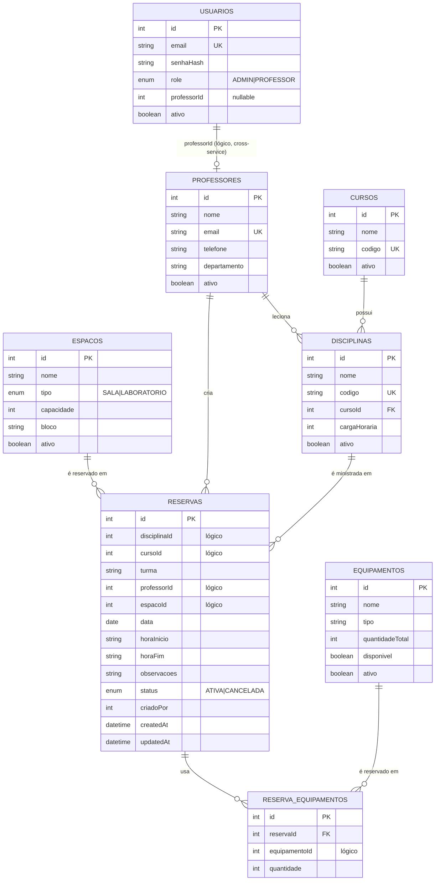
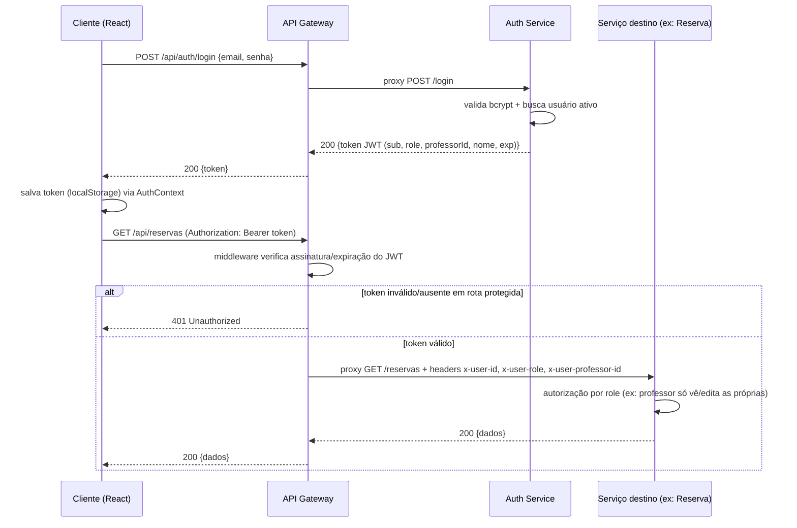

# SARC 2 — Sistema de Alocação de Recursos e Consultas

Sistema universitário de gerenciamento e reserva de salas, laboratórios e
equipamentos, construído como um conjunto de microsserviços Node.js/Express,
com frontend React, banco MySQL (Prisma), observabilidade via
Prometheus/Grafana e logs estruturados via Winston.

## Sumário

- [Perfis de usuário](#perfis-de-usuário)
- [Arquitetura](#arquitetura)
- [Microsserviços](#microsserviços)
- [Modelo de dados (ER)](#modelo-de-dados-er)
- [Fluxo de autenticação](#fluxo-de-autenticação)
- [Regras de negócio](#regras-de-negócio)
- [Como executar](#como-executar)
- [Variáveis de ambiente](#variáveis-de-ambiente)
- [Endpoints](#endpoints)
- [Observabilidade](#observabilidade)
- [Qualidade de código](#qualidade-de-código)
- [Coleção Postman](#coleção-postman)
- [Estrutura do repositório](#estrutura-do-repositório)

## Perfis de usuário

| Perfil | Acesso | Capacidades |
|---|---|---|
| **Aluno** | Público, sem login, via URL | Consulta salas, laboratórios, professores, equipamentos disponíveis, horário de aula, disciplina e dia da semana. Não altera nada. |
| **Professor** | Login (JWT `ROLE_PROFESSOR`) | Cria/edita/cancela reservas próprias, consulta disponibilidade, visualiza conflitos. |
| **Administrador** | Login (JWT `ROLE_ADMIN`) | Acesso total: cadastra/edita/remove/ativa-desativa professores, salas, laboratórios, equipamentos, cursos, disciplinas; altera qualquer reserva; visualiza relatórios. |

## Arquitetura

Arquitetura de microsserviços com um API Gateway como ponto único de entrada.
Comunicação entre serviços é síncrona via REST/HTTP interno (sem message
broker). Cada serviço com persistência tem seu próprio banco lógico dentro de
uma única instância MySQL.

```mermaid
flowchart TB
    subgraph Clientes
        Aluno["Aluno (público, sem login)"]
        Prof["Professor (JWT ROLE_PROFESSOR)"]
        Admin["Administrador (JWT ROLE_ADMIN)"]
    end

    Aluno -->|HTTP| FE[Frontend React/Vite]
    Prof -->|HTTP| FE
    Admin -->|HTTP| FE

    FE -->|Axios REST + Bearer JWT| GW[API Gateway :3000]

    GW -->|/api/auth| AUTH[Auth Service :3001]
    GW -->|/api/professores /api/cursos /api/disciplinas| PROF[Professor Service :3002]
    GW -->|/api/espacos| SALA[Sala Service :3003]
    GW -->|/api/equipamentos| EQUIP[Equipamento Service :3004]
    GW -->|/api/reservas| RES[Reserva Service :3005]
    GW -->|/api/consulta (público)| CONS[Consulta Service :3006]

    RES -.->|valida espaço ativo| SALA
    RES -.->|valida equipamento disponível| EQUIP
    RES -.->|valida professor ativo| PROF
    CONS -.->|lê dados públicos| PROF
    CONS -.->|lê dados públicos| SALA
    CONS -.->|lê dados públicos| EQUIP
    CONS -.->|lê grade de horários| RES
    PROF -.->|cria credencial ao cadastrar professor| AUTH

    AUTH --> DB1[(MySQL auth_db)]
    PROF --> DB2[(MySQL professor_db)]
    SALA --> DB3[(MySQL sala_db)]
    EQUIP --> DB4[(MySQL equipamento_db)]
    RES --> DB5[(MySQL reserva_db)]

    AUTH -.->|/metrics| PROM[Prometheus :9090]
    PROF -.->|/metrics| PROM
    SALA -.->|/metrics| PROM
    EQUIP -.->|/metrics| PROM
    RES -.->|/metrics| PROM
    CONS -.->|/metrics| PROM
    GW -.->|/metrics| PROM
    PROM --> GRAF[Grafana :3300]
```

## Microsserviços

| Serviço | Porta | Responsabilidade | Banco |
|---|---|---|---|
| `api-gateway` | 3000 | Ponto único de entrada, verificação de JWT, injeção de identidade (`x-user-*`), rate limiting, CORS | — |
| `auth-service` | 3001 | Login, hash de senha, emissão/validação de JWT, gestão de credenciais | `auth_db` |
| `professor-service` | 3002 | CRUD de professores, cursos e disciplinas | `professor_db` |
| `sala-service` | 3003 | CRUD de salas e laboratórios (tabela única `espacos`, campo `tipo`) | `sala_db` |
| `equipamento-service` | 3004 | CRUD de equipamentos e controle de quantidade/disponibilidade | `equipamento_db` |
| `reserva-service` | 3005 | Criação/edição/cancelamento de reservas, detecção de conflitos, orquestração | `reserva_db` |
| `consulta-service` | 3006 | Agregador público e somente leitura para a página do aluno | — |
| `frontend` | 5173 (dev) / 80 (prod) | React + Vite + MUI + React Router + Axios | — |

Não existe serviço dedicado a "curso/disciplina" nem a "laboratório" na lista
original de microsserviços — por coesão de domínio, cursos e disciplinas
ficam no `professor-service` (domínio acadêmico) e laboratórios ficam no
`sala-service` junto com salas (ambos são "espaços físicos reserváveis",
diferenciados pelo campo `tipo`).

## Modelo de dados (ER)



Como cada serviço tem seu próprio banco, as relações entre entidades de
serviços diferentes são **lógicas** (não FKs físicas) — validadas via
chamada HTTP síncrona no momento da criação/edição de reservas e professores.

## Fluxo de autenticação



O `auth-service` é o único serviço que assina tokens JWT. O `api-gateway`
apenas verifica a assinatura (quando um token é enviado) e injeta a
identidade decodificada como headers (`x-user-id`, `x-user-role`,
`x-user-professor-id`, `x-user-nome`) nas requisições repassadas aos
serviços internos. Rotas do `consulta-service` e as listagens públicas
(`GET /professores`, `GET /espacos`, etc.) não exigem token.

## Regras de negócio

1. **Sem conflito de sala/laboratório**: duas reservas ativas não podem se sobrepor no mesmo espaço/data.
2. **Sem conflito de professor**: um professor não pode ter duas reservas ativas sobrepostas.
3. **Disponibilidade de equipamento**: a soma reservada num intervalo sobreposto não pode exceder a quantidade total do equipamento.
4. **Autorização**: professor só altera/cancela suas próprias reservas; administrador altera qualquer uma.
5. Toda reserva registra `createdAt`, `updatedAt` e `criadoPor` automaticamente.
6. Aluno tem acesso apenas de leitura, sem autenticação.

## Como executar

### Pré-requisitos

- Docker e Docker Compose
- (Opcional, para rodar serviços fora do Docker) Node.js 20+ e um MySQL 8 local

### Subindo tudo com Docker Compose

```bash
cp .env.example .env
# edite o .env se desejar trocar senhas/segredos padrão

docker compose up --build
```

Isso sobe: `mysql`, os 6 microsserviços, `api-gateway`, `frontend`,
`prometheus` e `grafana`. O `auth-service` aplica as migrations Prisma e
cria automaticamente o administrador inicial (`SEED_ADMIN_EMAIL`/
`SEED_ADMIN_PASSWORD`, padrão `admin@sarc2.local` / `Admin@12345`).

Acessos padrão (portas configuráveis no `.env`):

| Serviço | URL |
|---|---|
| Frontend | http://localhost:5173 |
| API Gateway | http://localhost:3000/api |
| Prometheus | http://localhost:9090 |
| Grafana | http://localhost:3300 (login `admin`/`admin`) |

### Rodando um serviço isoladamente (desenvolvimento)

```bash
cd services/auth-service
cp .env.example .env
npm install
npx prisma migrate dev
npm run seed   # apenas auth-service
npm run dev
```

Cada serviço (`gateway/`, `services/*/`, `frontend/`) tem seu próprio
`README.md` com instruções específicas.

## Variáveis de ambiente

Ver [`.env.example`](.env.example) na raiz (usado pelo `docker-compose.yml`)
e o `.env.example` de cada serviço/pasta para execução isolada. Principais:

| Variável | Descrição |
|---|---|
| `MYSQL_ROOT_PASSWORD`, `MYSQL_USER`, `MYSQL_PASSWORD` | Credenciais do MySQL compartilhado |
| `JWT_SECRET`, `JWT_EXPIRES_IN` | Segredo/validade do token (compartilhado entre `api-gateway` e `auth-service`) |
| `INTERNAL_API_KEY` | Chave usada nas rotas `/internal/*` (comunicação serviço-a-serviço sensível) |
| `SEED_ADMIN_NAME/EMAIL/PASSWORD` | Administrador criado automaticamente no primeiro start |
| `GRAFANA_ADMIN_USER/PASSWORD` | Login inicial do Grafana |
| `*_PORT` | Portas expostas no host para cada serviço |
| `CORS_ORIGIN` | Origem permitida (URL do frontend) |

## Endpoints

Tabela resumida (ver os `README.md` de cada serviço para detalhes completos
de payloads). Todos os caminhos abaixo são relativos a `http://localhost:3000/api`.

| Método | Caminho | Auth | Descrição |
|---|---|---|---|
| POST | `/auth/login` | Público | Login (professor/admin) |
| GET | `/auth/me` | JWT | Identidade do usuário logado |
| GET/POST/PUT/PATCH/DELETE | `/professores` | Público (GET) / ADMIN | CRUD de professores |
| GET/POST/PUT/PATCH/DELETE | `/cursos` | Público (GET) / ADMIN | CRUD de cursos |
| GET/POST/PUT/PATCH/DELETE | `/disciplinas` | Público (GET) / ADMIN | CRUD de disciplinas |
| GET/POST/PUT/PATCH/DELETE | `/espacos` | Público (GET) / ADMIN | CRUD de salas/laboratórios (`tipo=SALA\|LABORATORIO`) |
| GET/POST/PUT/PATCH/DELETE | `/equipamentos` | Público (GET) / ADMIN | CRUD de equipamentos |
| GET/POST/PUT/PATCH | `/reservas` | PROFESSOR/ADMIN | Reservas (criar, editar, listar, cancelar) |
| GET | `/reservas/disponibilidade` | PROFESSOR/ADMIN | Checagem rápida de conflito |
| GET | `/consulta/salas` \| `/laboratorios` \| `/professores` \| `/equipamentos` \| `/grade` | Público | Consulta do aluno |

## Observabilidade

Ver [`monitoring/README.md`](monitoring/README.md) para a lista completa de
métricas expostas e o dashboard Grafana pré-configurado (requisições HTTP,
tempo de resposta, erros, uso de CPU/memória, reservas, usuários, conflitos).

## Qualidade de código

- **ESLint** (flat config, `eslint.config.js` na raiz, cobre todo o monorepo)
- **Prettier** (`.prettierrc`)
- **Husky** + **lint-staged** (`pre-commit` roda lint/format nos arquivos staged)
- **commitlint** (`commit-msg` valida Conventional Commits)
- `.env.example` em cada serviço, nenhum segredo real commitado

```bash
npm install     # na raiz, instala as ferramentas de repositório
npm run lint
npm run format
```

## Coleção Postman

[`docs/postman/SARC2.postman_collection.json`](docs/postman/SARC2.postman_collection.json)
— cobre login (admin e professor), cadastro de professor/curso/disciplina/
sala/laboratório/equipamento, criação de reserva, tentativa de reserva
conflitante (409 esperado), cancelamento e as consultas públicas do aluno.

## Estrutura do repositório

```
SARC2/
├── frontend/                  # React + Vite + MUI
├── gateway/                   # API Gateway
├── services/
│   ├── auth-service/
│   ├── professor-service/
│   ├── sala-service/
│   ├── equipamento-service/
│   ├── reserva-service/
│   └── consulta-service/
├── database/
│   └── init/                  # script de criação dos 5 databases MySQL
├── monitoring/
│   ├── prometheus/
│   └── grafana/
├── docs/
│   └── postman/
├── docker-compose.yml
└── README.md
```
