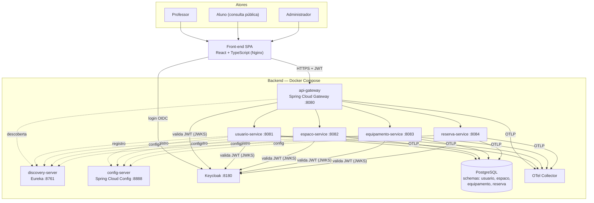

# 01 — Visão Geral da Arquitetura

## 1. Contexto

O SARC permite que **professores** reservem salas, laboratórios e equipamentos,
que **alunos** consultem publicamente onde ocorrerão as aulas, e que **administradores**
cadastrem espaços e equipamentos (requisitos do T1, US01–US11; modelo de dados do T2).

## 2. Estilo arquitetural

Adotamos **microserviços** (ADR-001), decompostos por agregado de domínio do modelo
relacional do T2:

| Serviço | Agregado (tabelas) | Responsabilidade |
|---|---|---|
| `usuario-service` | USUARIO, PROFESSOR, ALUNO, ADMIN | Perfis e dados cadastrais dos usuários (a autenticação é do Keycloak) |
| `espaco-service` | ESPACO | CRUD de salas e laboratórios |
| `equipamento-service` | EQUIPAMENTO | CRUD de equipamentos e seu status |
| `reserva-service` | RESERVA, RESERVA_EQUIPAMENTO | Reservas, controle de conflitos, agenda pública |

Serviços de infraestrutura (Spring Cloud — ADR-002/003/004):

| Serviço | Papel |
|---|---|
| `api-gateway` (Spring Cloud Gateway) | Ponto único de entrada, roteamento, validação de JWT, CORS, rate limiting |
| `discovery-server` (Eureka) | Service Discovery — registro e localização dinâmica dos serviços |
| `config-server` (Spring Cloud Config) | Configuração centralizada versionada em Git |

Infraestrutura de apoio: **PostgreSQL** (compartilhado, schemas separados — ADR-005),
**Keycloak** (ADR-006), **OTel Collector + Jaeger + Prometheus + Grafana** (ADR-007),
**SonarQube** (ADR-008).

## 3. Diagrama de containers (C4 nível 2)

## 4. Decisões-chave (índice de ADRs)

- ADR-001 — Estilo de microserviços
- ADR-002 — Spring Cloud Gateway como API Gateway
- ADR-003 — Eureka como Service Discovery
- ADR-004 — Spring Cloud Config para configuração centralizada
- ADR-005 — Banco PostgreSQL compartilhado com schema por serviço
- ADR-006 — Keycloak + OpenID Connect para segurança
- ADR-007 — Observabilidade com OpenTelemetry (OTEL)
- ADR-008 — SonarQube para monitoramento de testes e qualidade
- ADR-009 — Front-end React SPA
- ADR-010 — Documentação com Swagger/OpenAPI (springdoc)

## 5. Comunicação entre serviços

- **Cliente → serviços:** sempre via Gateway (REST/JSON).
- **Serviço → serviço:** REST síncrono via Eureka (`lb://<service-id>`) usando OpenFeign,
  apenas para validações pontuais (ex.: `reserva-service` valida existência de espaço e
  equipamentos). O acoplamento é minimizado mantendo cada regra de negócio no serviço dono do dado.
- **Consulta pública de agenda (US10/US11):** rota `GET /api/agenda/**` liberada sem
  autenticação no Gateway.
