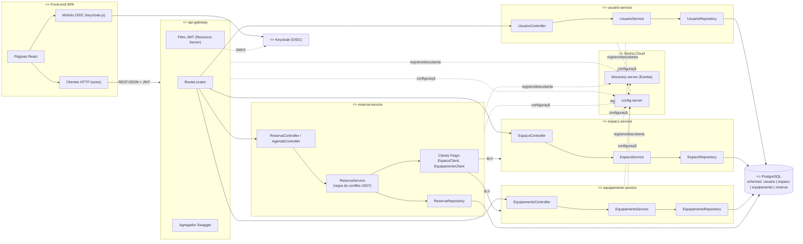

# Diagrama UML de Componentes

**Notas**

- Interfaces providas: cada serviço expõe sua API REST descrita em OpenAPI (`/v3/api-docs`).
- Interfaces requeridas: `reserva-service` consome `espaco-service` e `equipamento-service`
  (validação de existência/status) via OpenFeign com descoberta pelo Eureka.
- O Gateway é o único componente exposto ao front-end.
