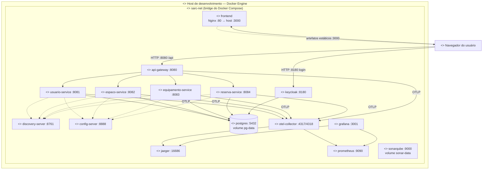

# Diagrama UML de Implantação (Deployment)

**Portas expostas ao host:** 3000 (front), 8080 (gateway), 8180 (Keycloak),
8761 (Eureka UI), 16686 (Jaeger), 9090 (Prometheus), 3001 (Grafana), 9000 (SonarQube).
Os microserviços de negócio **não** são expostos diretamente — apenas via Gateway.
