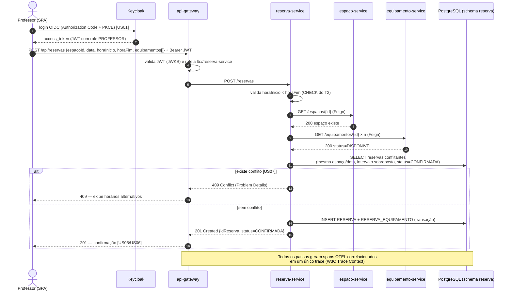

# Diagrama UML de Sequência — Criar Reserva (US05, US06, US07)

```mermaid
sequenceDiagram
    autonumber
    actor P as Professor (SPA)
    participant KC as Keycloak
    participant GW as api-gateway
    participant RS as reserva-service
    participant ES as espaco-service
    participant EQ as equipamento-service
    participant DB as PostgreSQL (schema reserva)

    P->>KC: login OIDC (Authorization Code + PKCE)  [US01]
    KC-->>P: access_token (JWT com role PROFESSOR)

    P->>GW: POST /api/reservas {espacoId, data, horaInicio, horaFim, equipamentos[]} + Bearer JWT
    GW->>GW: valida JWT (JWKS) e roteia lb://reserva-service
    GW->>RS: POST /reservas
    RS->>RS: valida horaInicio < horaFim (CHECK do T2)
    RS->>ES: GET /espacos/{id} (Feign)
    ES-->>RS: 200 espaço existe
    RS->>EQ: GET /equipamentos/{id} × n (Feign)
    EQ-->>RS: 200 status=DISPONIVEL
    RS->>DB: SELECT reservas conflitantes<br/>(mesmo espaço/data, intervalo sobreposto, status=CONFIRMADA)
    alt existe conflito [US07]
        RS-->>GW: 409 Conflict (Problem Details)
        GW-->>P: 409 — exibe horários alternativos
    else sem conflito
        RS->>DB: INSERT RESERVA + RESERVA_EQUIPAMENTO (transação)
        RS-->>GW: 201 Created {idReserva, status=CONFIRMADA}
        GW-->>P: 201 — confirmação [US05/US06]
    end

    Note over GW,DB: Todos os passos geram spans OTEL correlacionados<br/>em um único trace (W3C Trace Context)
```
